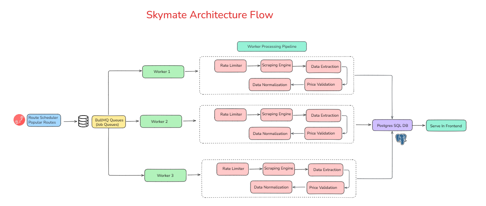

# ✈️SkyMate: Flight Search and Price Comparison platform

I was finding it difficult to get cheapest flight prices across different airlines ,hence i built a webscraper which scrapes data from different airlines websites(currently 3) and returns the cheapest price among all the airlines.This tool works for all major Indian routes and airlines.You can also bookmark your flights so that you will be notified once price drops below certain threshold.I am also working on the historic prices graphs so that users would be able to get more perspectives on fluctuation of flight prices!!

SkyMate is a comprehensive flight search and booking platform designed to simplify the process of finding and booking the best flight deals. It aggregates flight data from multiple airlines, including Akasa, Indigo, and Spicejet, providing users with a unified search experience. SkyMate aims to solve the problem of scattered flight information, making it easier for users to compare prices and book flights from a single platform.

-----

## Architecture Flow



The architecture of SkyMate is designed for scalability and efficiency. Here's a breakdown of the flow:

1. **Route Scheduler**: The process begins with the Route Scheduler, which identifies popular flight routes to be scraped.
2. **Job Queues**: These routes are then sent to BullMQ, which acts as a job queue, managing the scraping tasks.
3. **Workers**: Multiple workers pick up jobs from the queue. Each worker is responsible for scraping data from a specific airline.
4. **Worker Processing Pipeline**:
    * **Rate Limiter**: To avoid overwhelming the airline's servers, each worker has a rate limiter.
    * **Scraping Engine**: This engine fetches the raw flight data from the airline's website.
    * **Data Extraction**: The relevant information (like flight times, prices, etc.) is extracted from the raw data.
    * **Price Validation & Data Normalization**: The extracted data is then validated and normalized to ensure consistency across different airlines.
5. **Postgres SQL DB**: The cleaned and processed data is stored in a PostgreSQL database.
6. **Serve in Frontend**: Finally, the data from the database is served to the frontend, where users can search and compare flight prices.

-----

## Features

  - ✨ **Comprehensive Flight Search:** Search for flights across multiple airlines (Akasa, Indigo, Spicejet) simultaneously.
  - 🚀 **Real-time Data:** Provides up-to-date flight information and pricing.
  - 💡 **User Authentication:** Secure user accounts for personalized booking and tracking.
  - ✈️ **Bookmark Flights:** Save favorite flight options for later review.
  - ⚙️ **Cron Job Scheduling:** Automated data scraping to keep flight information current.

-----

## API Routes

*The following API routes are inferred from the provided file data. Please refer to the actual backend code for the most accurate documentation.*

**Note:** The base URL for these endpoints is not explicitly defined in the file data and should be configured accordingly in your environment.

### Get flight names

  - **Method**: GET
  - **Endpoint**: `/api/names`
  - **Description**: Retrieves a list of available flight origin and destination names.
  - **Response**:

<!-- end list -->

```json
[
    {
        "name": "Mumbai"
    },
    {
        "name": "Delhi"
    }
]
```

### Get Searched Flights

  - **Method**: GET
  - **Endpoint**: `/api/flights/search`
  - **Description**: Returns flights based on search input.
  - **Request Body**:

<!-- end list -->

```json
    {
        "departure": "Mumbai",
        "destination": "Delhi",
        "date": "2024-12-25"
    }
```

  - **Response**:

<!-- end list -->

```json
[
    {
        "flightNumber": "6E2002",
        "departureTime": "20:55",
        "arrivalTime": "23:00",
        "price": 4000,
        "airline": "Indigo"
    },
    {
        "flightNumber": "SG 474",
        "departureTime": "22:10",
        "arrivalTime": "00:20",
        "price": 4200,
        "airline": "Spicejet"
    }
]
```


-----

## Technologies Used

  - **Frontend:**
      - [React](https://reactjs.org/): A JavaScript library for building user interfaces.
      - [Vite](https://vitejs.dev/): A build tool that provides a fast and optimized development experience.
  - **Backend:**
      - [Node.js](https://nodejs.org/): A JavaScript runtime built on Chrome's V8 JavaScript engine.
      - [Express.js](https://expressjs.com/): A web application framework for Node.js.
      - [Supabase](https://supabase.com/): An open-source Firebase alternative.
  - **Other:**
      - [ESLint](https://eslint.org/): A JavaScript linting tool.
      - [Cron](https://www.npmjs.com/package/cron): A job scheduler for executing tasks at specific intervals.

-----

## Installation

1.  **Clone the repository:**

    ```bash
    git clone <repository_url>
    cd SkyMate
    ```

2.  **Install Backend dependencies:**

    ```bash
    cd Backend
    npm install
    ```

3.  **Install Frontend dependencies:**

    ```bash
    cd Frontend
    npm install
    ```

4.  **Set up Supabase:**

<!-- end list -->

  - Create a new project on [Supabase](https://supabase.com/).
  - Configure the Supabase client in `Backend/Config/supabaseClient.js` with your project URL and API key.

<!-- end list -->

5.  **Configure Environment Variables:**

<!-- end list -->

  - Create a `.env` file in the `Backend` directory.
  - Add necessary environment variables.

-----

## Usage

1.  **Start the Backend server:**

    ```bash
    cd Backend
    npm start
    ```

2.  **Start the Frontend development server:**

    ```bash
    cd Frontend
    npm run dev
    ```

3.  **Access the application in your browser at `http://localhost:5173` (or the port specified by Vite).**

-----

## Project Structure

```
SkyMate/
├── Backend/                    # Backend server code
│   ├── Auth/                   # Authentication related files
│   │   ├── Indigo/             # Indigo Authentication logic
│   │   │   └── fetchToken.js     # Fetch Token for Indigo
│   │   └── Spicejt/            # Spicejet Authentication logic
│   │       └── fetchSpicejetToken.js # Fetch Token for Spicejet
│   ├── Config/                 # Configuration files
│   │   └── supabaseClient.js     # Supabase client configuration
│   ├── Controllers/            # API endpoint controllers
│   │   ├── Akasa/              # Akasa API logic
│   │   │   └── Akasaapi.js       # Akasa Flight API
│   │   ├── Indigo/             # Indigo API logic
│   │   │   └── getFlightsindigo.js # Function to get Indigo flights
│   │   ├── Spicejet/           # Spicejet API logic
│   │   │   └── getFlightsSpicejet.js # Function to get Spicejet flights
│   │   ├── bookmark/           # Bookmark API logic
│   │   │   └── bookmark.js       # Bookmark functionalities
│   │   ├── getapis/            # General API Logic
│   │   │   ├── getNames.js       # Function to get flight names
│   │   │   └── searchFlights.js  # Function to search flights
│   │   ├── lib/                # Libraries
│   │   │   ├── ratelimiter.js    # Rate limiter functionality
│   │   │   └── validator.js      # Validator functionality
│   │   ├── AllFlights.js         # Controller to fetch all flights
│   │   ├── CombinedGetStore.js   # Controller to combine and store flights
│   │   ├── SearchGetFlights.js   # Controller to search flights
│   │   └── userReadWrite.js      # Controller for User Read and Write
│   ├── Routes/                 # API routes
│   │   ├── Akasaroutes.js        # Akasa routes
│   │   ├── indigoroutes.js       # Indigo routes
│   │   ├── MainRoutes.js         # Main routes
│   │   └── spicejetroutes.js     # Spicejet routes
│   ├── ScrapingRoutes.js         # Routes for scraping
│   ├── Utility/                # Utility Functions
│   │   ├── WithRetries.js        # Utility function for retries
│   │   ├── attachencodedtime.js  # Utility Function to attach encoded time
│   │   └── randtimout.js         # Utility Function for random timeout
│   ├── middlewares/            # Middlewares
│   │   └── ValdiateFlightRequest.js # Middleware to validate flight requests
│   ├── CronScraper.js          # Cron job scheduler
│   ├── package-lock.json       # Backend package lock file
│   ├── package.json            # Backend package file
│   └── Server.js               # Main server file
├── Frontend/                   # Frontend application code
│   ├── public/                 # Public assets
│   │   ├── clouds.jpg
│   │   ├── images/
│   │   │   ├── landscape-placeholder.svg
│   │   │   ├── mumbai.jpg
│   │   │   ├── newDelhi.jpg
│   │   │   └── tajmahal.jpg
│   │   ├── plane_flying.jpg
│   │   └── vite.svg
│   ├── src/                    # Source code
│   │   ├── assets/             # Assets
│   │   │   └── react.svg
│   │   ├── components/         # React components
│   │   │   ├── search-result/  # Search result components
│   │   │   │   └── SearchResultTable.jsx
│   │   │   ├── top-deals/      # Top deals components
│   │   │   │   ├── deal-card.jsx
│   │   │   │   └── top_dealSection.jsx
│   │   │   └── ui/             # UI components
│   │   │       └── button.jsx
│   │   ├── lib/                # Library functions
│   │   │   ├── fetchNames.js     # Function to fetch names
│   │   │   └── utils.js          # Utility functions
│   │   ├── pages/              # React Pages
│   │   │   ├── DealsPage.jsx     # Deals Page component
│   │   │   ├── HomePage.jsx      # Home Page component
│   │   │   ├── Layout.jsx        # Layout component
│   │   │   ├── SearchResults.jsx # Search Results component
│   │   │   ├── Signup.jsx        # Sign Up Component
│   │   │   ├── SkymateWhat.jsx   # Skymate Explanation Component
│   │   │   └── Working.jsx       # Working Explanation Component
│   │   ├── routes/             # Routes directory
│   │   │   └── searchApi.js
│   │   ├── App.css             # Main application CSS
│   │   ├── App.jsx             # Main application component
│   │   ├── index.css           # Index CSS
│   │   ├── main.jsx            # Entry point for React application
│   ├── .gitignore              # Git ignore file for Frontend
│   ├── components.json         # Components JSON
│   ├── eslint.config.js        # ESLint configuration
│   ├── index.html              # Main HTML file
│   ├── jsconfig.json           # JS Configuration
│   ├── package-lock.json       # Frontend package lock file
│   ├── package.json            # Frontend package file
│   ├── README.md               # Frontend README file
│   └── vite.config.js          # Vite configuration file
├── package-lock.json           # Main package lock file
└── package.json                # Main package file
```

-----

## License

MIT
